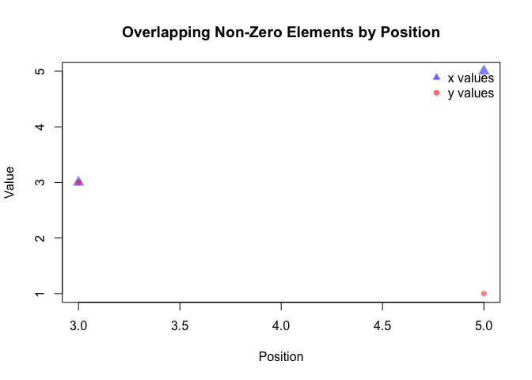

<!-- README.md is generated from README.Rmd. Please edit that file -->

# sparseVector

<!-- badges: start -->

[](https://github.com/vramdas06/sparseVectorClass/actions/workflows/R-CMD-check.yaml)
<!-- badges: end -->

sparseVector implements an S4 class for sparse numeric vectors, vectors
where most elements are zeros. By storing only non-zero values and their
positions, operations are much faster than regular dense vectors. The
package provides methods for converting between sparse and dense
formats, arithmetic operations (addition, subtraction, multiplication),
and computing mean, norm, and standardized vectors. You can also
visualize overlapping non-zero elements between vectors using
sparseVector.

## Installation

You can install the development version of sparseVector like so:

``` r
devtools::install_github("vramdas06/sparseVectorClass")
```

## Example

This is a basic example which shows you how to use sparseVector:

``` r
library(sparseVector)
#> 
#> Attaching package: 'sparseVector'
#> The following object is masked from 'package:base':
#> 
#>     norm
x <- c(1, 0, 3, 0, 5, 0, 0)
sparse_x <- as(x, "sparse_numeric")
sparse_x
#> Sparse numeric vector of length 7 
#> Non-zero elements:
#>   pos value
#> 1   1     1
#> 2   3     3
#> 3   5     5

x <- as(c(1, 0, 3, 0, 5), "sparse_numeric")
y <- as(c(0, 2, 3, 0, 1), "sparse_numeric")

# Add two sparse vectors
x + y
#> Sparse numeric vector of length 5 
#> Non-zero elements:
#>   pos value
#> 1   1     1
#> 2   2     2
#> 3   3     6
#> 4   5     6

# Subtract
x - y
#> Sparse numeric vector of length 5 
#> Non-zero elements:
#>   pos value
#> 1   1     1
#> 2   2    -2
#> 3   5     4

# Multiply (element-wise)
x * y
#> Sparse numeric vector of length 5 
#> Non-zero elements:
#>   pos value
#> 1   3     9
#> 2   5     5

# Plot
plot(x, y)
```


